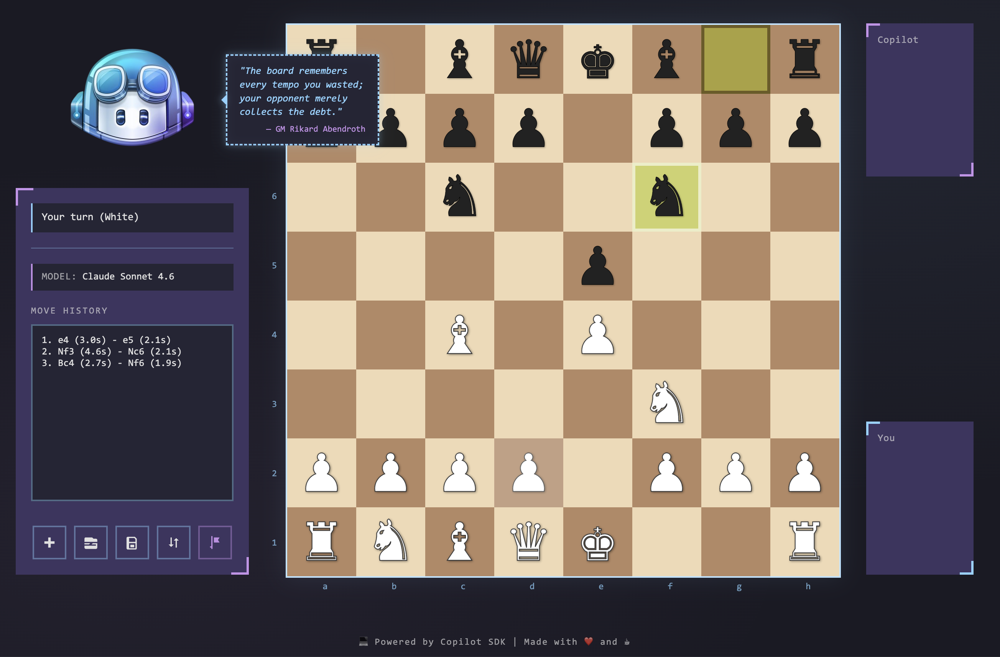

# ♟️ Copilot Chess 🤖

Play chess against GitHub Copilot! Choose any available Copilot model and challenge it to a game. Built with the `@github/copilot-sdk`, chess.js, and a retro terminal-style UI.




## Prerequisites

- Node.js v18+
- GitHub Copilot CLI installed and authenticated

## Quick Start

```bash
npm install
npm start
```

Then open http://localhost:3000, pick a model, and start playing! ♟️
